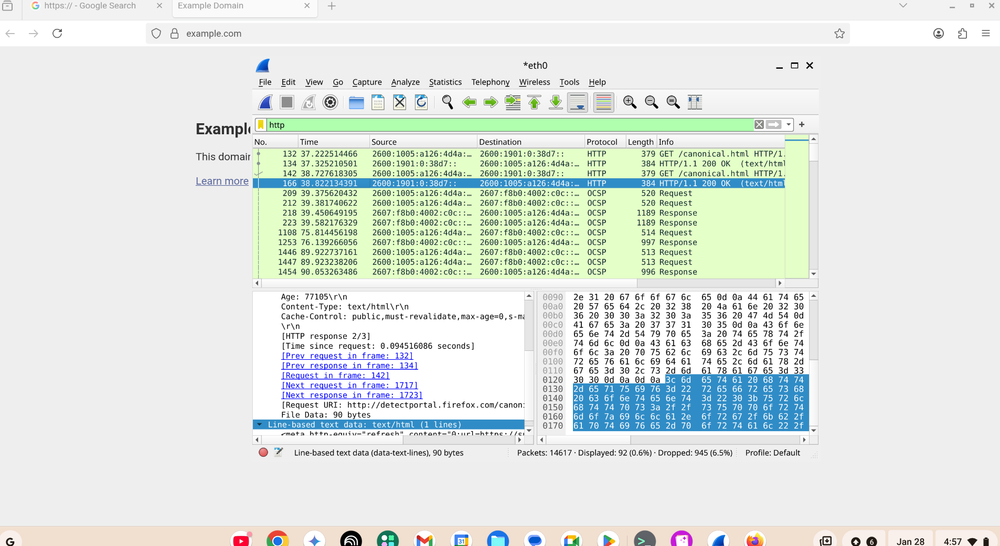
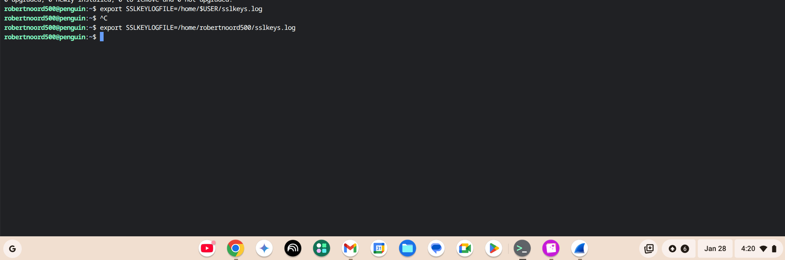

# 🔐 Wireshark TLS Decryption Lab

## 📌 Project Overview
This project demonstrates how encrypted network traffic can be analyzed and decrypted using **Wireshark** with proper authorization. The goal of this lab was to understand how **TLS (Transport Layer Security)** protects data in transit and how security analysts ethically decrypt traffic using session keys for visibility during investigations and troubleshooting.

This lab reflects real-world techniques used by **SOC analysts and network security teams**.

---

## 🛠 Tools & Technologies
- Wireshark  
- TLS / HTTPS  
- TCP/IP  
- TLS Session Keys (Key Log File)  
- Packet Capture (PCAP Analysis)  

---

## 🎯 Objectives
- Capture encrypted HTTPS traffic
- Identify TLS handshakes and encrypted payloads
- Configure Wireshark for TLS decryption
- Analyze decrypted application-layer data
- Understand challenges with encrypted traffic visibility

---

## 🔍 Lab Walkthrough

### 1️⃣ Capture Encrypted Traffic
- Generated HTTPS traffic by visiting secure websites
- Captured packets using Wireshark
- Verified encryption by observing `TLS` packets and unreadable payloads

---

### 2️⃣ Identify TLS Handshake
- Located:
  - Client Hello  
  - Server Hello  
  - Key Exchange  
- Confirmed encrypted communication over TCP port 443

---

### 3️⃣ Configure TLS Decryption
- Created and referenced a **TLS key log file**
- Configured Wireshark:
  - `Edit → Preferences → Protocols → TLS`
  - Loaded key log file path
- Restarted capture to apply changes

---

### 4️⃣ Decrypt and Analyze Traffic
- Observed decrypted HTTP data within previously encrypted sessions
- Analyzed:
  - URLs
  - HTTP headers
  - Application-layer content
- Confirmed successful decryption without breaking encryption standards

---

## 🧠 Key Concepts Learned

### 🔐 What is TLS?
TLS encrypts data in transit to protect confidentiality and integrity between clients and servers.

### 🔑 Why Decryption Was Possible
- Authorized access to session keys
- Decryption performed ethically using key logs
- Mirrors enterprise SOC environments for traffic inspection

### 🌐 Why This Matters
- Most modern web traffic is encrypted
- Security teams still need visibility for:
  - Threat detection
  - Malware analysis
  - Incident response

---

## ⚠️ Challenges & Solutions

| Challenge | Solution |
|--------|----------|
| Traffic remained encrypted | Verified key log file path and restarted capture |
| No HTTP data visible | Ensured TLS protocol was enabled |
| TLS handshake confusion | Broke packets down step-by-step |

---

## 📊 Skills Demonstrated
- Network traffic analysis
- TLS/HTTPS fundamentals
- Packet inspection and decryption
- Security troubleshooting
- SOC-level investigative skills

---

## 📸 Screenshots
> Add screenshots below:

